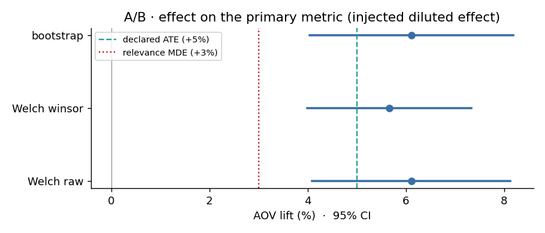

# A/B testing in a marketplace — does a product page redesign increase AOV?

> Portfolio project · **CRISP-DM** methodology · public **Brazilian E-Commerce by Olist** dataset
> Experimental design, power analysis, assumption checks, A/A calibration and product decision
> evaluation for a marketplace.

📖 **[`docs/full_report.md`](docs/full_report.md)** — reference report: walks through
every phase, every decision, the results (written as a thesis-style report) and the limitations.

🇪🇸 **Versión canónica en español: [`../README.md`](../README.md)**. This is a full mirror kept in
sync with it; if the two ever disagree, the Spanish version is the source of truth.



---

## ⚠️ Note on methodological honesty (read this before the decision below)

The Olist dataset **does not contain a real experiment**: there are no control/treatment groups
and no traffic layer. In this project **the assignment is simulated** (50/50 per customer, fixed
seed) and **the redesign's effect is injected in a declared way** — *diluted* model: 20% of the
treated users respond with a +25% lift, for a mean effect (ATE) of **+5%**.

The goal is **not** to discover whether the redesign works (we know it does, because we are the
ones who put the effect there), but to **demonstrate that the experimental design and the
statistical analysis**:

- control false positives (validated over 2,000 A/A partitions → 5.0% rate, uniform p-values),
- recover an effect of known size **without bias** (mean of 500 replicates, raw = 4.97%; the true
  injected ATE is +5.00%),
- distinguish **statistical significance** from **business relevance** — and, beyond that,
  **measure the power of the decision rule itself** (not just of rejecting H0, see below),
- withstand **p-hacking** in the segment analysis.

This is the work a product experimentation team does — and, like any real analysis, a later review
found that two of its own conclusions didn't fully hold up (see "Methodological findings" below).
They were fixed with code, not just text: the section below already reflects the corrected result.

---

## Decision

**🟡 ITERATE** — the redesign lifts the AOV by **+5.7%** (95% CI [+4.0%, +7.3%]) very
significantly, but **does not** clear the real business relevance threshold at this dataset's
scale (see below). This is not a "doesn't work" verdict: it's "works, but not enough to justify
the redesign's cost at this volume — the design or the business case would need to be iterated on
before investing."

The +3% MDE declared in Phase 1 (`docs/01_business_understanding.md`) is only break-even for a
marketplace with **≥ ~415,000 orders/year**. This dataset's real volume (~58,700 orders/year)
requires, per the project's own cost model
([`src/mde_cost_model.py`](src/mde_cost_model.py)), a break-even of **+21.2%** — well above both
the true injected effect (+5%) and the observed one (+5.7%). Publishing "LAUNCH" using a R$ impact
computed on the real volume, but a relevance threshold designed for a ~7x larger marketplace, was
the internal contradiction that motivated this correction (see `2_impacto_negocio` in
[`outputs/tables/phase5_summary.json`](outputs/tables/phase5_summary.json) for the full numeric
detail, including the decision that would have been published under the declared MDE without this
fix).

---

## Results by CRISP-DM phase

| Phase | Content | Key result |
|---|---|---|
| **1 · Business Understanding** | Problem, H0/H1, primary metric (AOV), guardrails G1-G4, relevance MDE (+3%), decision rule | [`docs/01_business_understanding.md`](docs/01_business_understanding.md) |
| **2 · Data Understanding** | Profiling aimed at the question; **CC BY-NC-SA 4.0** license verified | Mean AOV R$ 137 · **CV 1.52 · skew 9.8** · `log(AOV)` nearly symmetric |
| **3 · Data Preparation** | 2017-01/2018-08 window · dedup to 1 order/customer · p99.5 winsorization only for the significance test · simulated assignment | 94,703 order-customers · **balance OK** (\|SMD\| ≤ 0.02) · **SRM OK** (p = 0.64) |
| **4 · Modeling** | Power analysis · assumptions · 2,000-partition A/A · A/B test · multi-seed A/B (incl. decision-rule power) · guardrail regression (two gates, G1-G4 quantified) · heterogeneous effect · clustered SE · cost model for the MDE | Detectable MDE **+2.3%** · A/A calibrated · dilution **< 1 pp** · +3% MDE = break-even **only at ≥ ~415k orders/year** |
| **5 · Evaluation** | Significance vs. relevance (at the REAL volume, not the MDE calibrated for a different scale) · ANCOVA · segments + BH · p-hacking | **+5.7% (winsor) / +6.1% (raw)**, both significant but below the real break-even (+21.2%) · guardrails intact · homogeneous effect → **ITERATE** |
| **6 · Deployment** | Executive summary · notebook · README · LinkedIn post | [`docs/executive_summary.md`](docs/executive_summary.md) · [`notebooks/ab_test_olist.ipynb`](notebooks/ab_test_olist.ipynb) |

### Methodological findings of the project

- **The power to reject H0 is not the power of the decision rule.** The design rejects H0 almost
  always (empirical power ≈ 100%), but the gate "95% CI entirely above the MDE" only fires in
  **~50% of 500 re-randomizations** (`8_ab_multiseed` in
  [`outputs/tables/phase4_summary.json`](outputs/tables/phase4_summary.json)). This repo's split
  (`SEED=42`) gave LAUNCH under the declared MDE because it happened to benefit from a favorable
  baseline imbalance in the primary metric (~+1.2 pp, now in the formal balance table below) — not
  because the design is "amply powered" for that decision.
- **The relevance MDE (+3%) is derived, not asserted — and you have to check at what volume it
  holds.** It is the redesign's *break-even* ([`src/mde_cost_model.py`](src/mde_cost_model.py)), but
  only for a marketplace with ≥ ~415k orders/year. Phase 5's R$ impact is computed on the dataset's
  **real** volume (~58.7k/year), at which the real break-even is +21.2%. Publishing "LAUNCH" while
  mixing both scales was an internal contradiction of the project — the headline decision now uses
  the break-even at the real volume, not the MDE meant for a ~7x larger scale.
- **Effect heterogeneity barely costs power** here (< 1 pp): the AOV's natural variance (CV ≈ 1.5)
  dominates the variance added by concentrating the effect in 20% of users. *This was quantified by
  simulation instead of assumed.*
- **Heteroscedasticity under H1** → the diluted effect inflates the *treatment* group's variance
  (Levene p = 1.6·10⁻⁶) → the primary test is **Welch, not Student**.
- **P-hacking demonstrated**: testing the wrong magnitude (lift in R$ instead of in %) and slicing
  by variables tied to basket size produces false "winning segments" that **survive Bonferroni**.
  On the correct scale (log, relative effect), nothing remains. *Correcting for multiplicity does
  not save a badly posed estimand.*
- **Winsorization, chosen to reduce variance, introduces a point bias of -0.36 pp**
  (verified with multi-seed A/B over 500 replicates, with a single cap always computed on the
  pre-effect outcome — [`src/effect_model.py::compute_winsor_cap`](src/effect_model.py); before,
  three different, incompatible cap calculations coexisted). Both raw (unbiased) and winsor are
  reported.
- **At large n, any guardrail regression is significant** → the rule needs **two gates**
  (significant **AND** magnitude ≥ threshold), not one — including G4 (basket-size drop), which used
  to gate on significance alone because it had no quantified magnitude threshold.

---

## Repository structure

```
├── params.yaml                  # SINGLE source of truth for the parameters (seed, alpha, effect...)
├── run_all.py                   # SINGLE entrypoint: runs the 6 phases + reproducibility report
├── data/
│   ├── raw/                     # 9 Olist CSVs (not versioned — see "Reproduce")
│   └── processed/               # analytical table (regenerable)
├── src/
│   ├── config.py                # loads params.yaml + absolute paths; no one else defines constants
│   ├── effect_model.py          # inject_diluted_effect (shared, no side effects)
│   ├── profiling_phase2.py       # Phase 2 — profiling
│   ├── figures_phase2.py         # Phase 2 — figures
│   ├── prepare_data.py          # Phase 3 — analytical table + simulated assignment
│   ├── balance_check.py         # Phase 3 — covariate balance check + SRM
│   ├── mde_cost_model.py        # Phase 4 — relevance MDE derived from a break-even
│   ├── modeling.py              # Phase 4 — power, assumptions, A/A, A/B, guardrails, multi-seed...
│   └── evaluation.py            # Phase 5 — decision, segments, p-hacking
├── tests/                       # pytest: config, effect_model, result invariants
├── notebooks/
│   ├── ab_test_olist.ipynb      # PRESENTATION notebook (only reads outputs/, computes nothing)
│   └── ab_test_olist.py         # jupytext source (version control)
├── outputs/{figures,tables}/    # figures + JSON/CSV results (regenerable)
├── docs/                        # informe_completo · 01..06 per phase · 4 audits (incl. audit_implementation.md) · exec. summary · LinkedIn post
├── requirements.txt · pytest.ini · LICENSE
```

---

## Reproduce

```bash
pip install -r requirements.txt

# data (not versioned, due to the CC BY-NC-SA 4.0 license)
python -m kaggle datasets download -d olistbr/brazilian-ecommerce -p data/raw --unzip
#   (or download manually from kaggle.com/datasets/olistbr/brazilian-ecommerce -> data/raw/)

python run_all.py        # ~2 min · runs the 6 phases and VERIFIES the key invariants
pytest                   # fast tests (config + effect + result invariants)
pytest -m slow           # also: re-runs and checks bit-for-bit idempotency
```

[`run_all.py`](run_all.py) finishes with a **reproducibility report** that checks, among others:
that the decision is one of LAUNCH/ITERATE/DO NOT LAUNCH with its justification (not that it has
to be "LAUNCH" specifically — an acceptance criterion fixed on the outcome isn't falsifiable, see
`tests/test_outputs.py::test_decision_consistent_with_real_volume_breakeven`), A/A false-positive
rate in [3.5%; 6.5%], A/B CI above the MDE, no SRM, no guardrail degraded — and **exits with code
≠ 0** if something doesn't check out.

### Reproducible design

- **A single parameter to touch:** everything lives in [`params.yaml`](params.yaml), loaded by
  [`src/config.py`](src/config.py). No other module defines `SEED`, `ALPHA`, the time window, etc.
  (there is a test that verifies this).
- **A single entrypoint:** [`run_all.py`](run_all.py) runs the phases in dependency order and fails
  if one does not generate its outputs.
- **No parallel execution paths:** the notebook **only reads** [`outputs/`](outputs/); it
  recomputes nothing.
- **Absolute paths:** works from any working directory.
- Fixed seeds → deterministic result (`pytest -m slow` checks bit-for-bit idempotency).

---

## Stack

Python · pandas · NumPy · SciPy · statsmodels (`TTestIndPower`, `OLS` with HC3 errors,
`multipletests` for Benjamini-Hochberg) · matplotlib · Jupyter / jupytext.

## Data and license

- **Dataset:** [Brazilian E-Commerce Public Dataset by Olist](https://www.kaggle.com/datasets/olistbr/brazilian-ecommerce)
  — **CC BY-NC-SA 4.0** license (non-commercial use). The raw CSVs are not included in the repo.
- **Code in this repository:** MIT.
